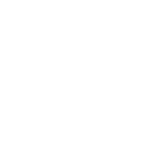

<br/>
<div align="center">

  

<br/></div>
<br/>
<div align="center">

  

<br/></div>


## Descrição do projeto

Essa é uma plataformar de rede social para animais que foi construida durante o curso React da Origamid. Onde api feita com wordpress. 

## Oque implementei a mais do projeto inicial:
- [x] Versão mobile com menu


#### Veja o projeto online: [Clique Aqui!]()


## 🛠 Tecnologias utilizadas

![react][react] ![javascript][javascript]

[react]: https://img.shields.io/badge/react-1E4174?style=for-the-badge&logo=react&logoColor=white

[javascript]: https://img.shields.io/badge/javascript-1E4174?style=for-the-badge&logo=javascript&logoColor=white


## Como rodar o projeto

Antes de iniciar, é necessário instalar as dependências do projeto. No terminal, execute o seguinte comando:

```bash
npm install
# ou
yarn

```
Para executar este projeto, você precisará adicionar as seguintes variáveis de ambiente ao seu arquivo `.env`:

```bash
VITE_APP_API_URL: GraphCMS API Link (usado no Apollo Client)
VITE_APP_API_TOKEN: GraphCMS Token (usado no Apollo Client para a autenticação da api)
```

Por fim, execute o comando:

```bash
npm run dev
# ou
yarn dev
```

Como contribuir

- Faça um fork deste repositório
- Crie uma nova branch (git checkout -b minha-nova-feature)
- Faça suas alterações e adicione os arquivos modificados (git add .)
- Faça o commit das suas alterações (git commit -m "Adiciona minha nova feature")
- Faça o push para a branch (git push origin minha-nova-feature)
- Abra um Pull Request

Licença

Este projeto está sob a licença MIT.
